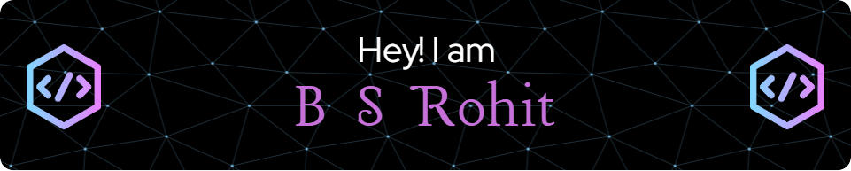

## 🚀 About Me

Hi, I'm Rohit! A passionate learner diving deep into the world of AI and Nanotechnology.

- 🌱 I’m learning **Machine Learning** and **Deep Learning**
- 🧪 I’m interested in **Artificial Intelligence** and **Nanotechnology**
- 💬 Ask me about anything related to **Python**, **ML**, and **AI**

---

## 🛠️ Tech Stack

  
  
  
  
  
  
  
  
  
  
  

---

## 💻 My Projects

### 🚀 [Image Dehazing using ResNet18](#)
A real-time image desmoking and dehazing system, maintaining high image clarity and efficient processing speed.

### 🔍 [Vehicle Detection and Classification - Using R-CNN](#)
This project implements a car detection system using PyTorch's Faster R-CNN with a ResNet-50 backbone and Feature Pyramid Networks (FPN).

### 🤖 [Speech Recognised Voice Bot](#)
Alpha is a speech-recognized voice bot that uses both ML and DL techniques for tasks like speech recognition, natural language processing, and question-answering.

---

## 🏆 My Achievements

- 🎉 Microsoft Certified: **Data Scientist**
- 🥇 Microsoft Azure AI Fundamentals Certificate
- 🌟 NPTEL Introduction to Machine Learning: **Elite Grade**

---

## 📈 GitHub Stats

  
  
  

---

## 📫 How to Reach Me

  
  
  

