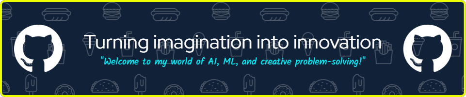

## 🚀 About Me
- 🌱 I’m learning **Machine Learning** and **Deep Learning**
- 🧪 I’m interested in **Artificial Intelligence** and **Nanotechnology**
- 💬 Ask me about anything related to **Python**, **ML**, and **AI**

---

## 🛠️ Tech Stack

  
  
  
  
  
  
  
  
  
  
  

---

## 💻 My Projects

### 🚀 [Intelligent Image Desmoking/Dehazing](#)

A real-time image desmoking and dehazing system, maintaining high image clarity and efficient processing speed.

---

### ⚡ [Vehicle Detection and Classification - Using R-CNN](#)
This project implements a car detection system using PyTorch's Faster R-CNN with a ResNet-50 backbone and Feature Pyramid Networks (FPN).

---

### 📊 [Speech Recognised Voice Bot](#)

Alpha is a speech-recognized voice bot that uses both ML and DL techniques for tasks like speech recognition, natural language processing, and question-answering.

---

## 📈 GitHub Stats

  
  

---

## 🏆 My Achievements

 🎉 Microsoft certified : Data Scientist

---

## 📫 How to Reach Me

  
  

